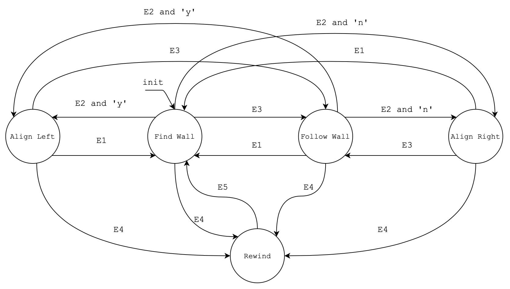
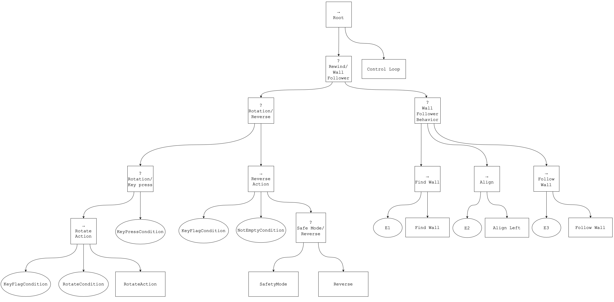

# High Level Control for Sensor Based Navigation using Behavior Trees
High level control denotes the ability of performing a complex task, which is assumed to be composed of many sub-tasks. The State of Art (SoA) offers the following solutions in order to implement high level control:
- Finite State Machines (FSMs)
- Behavior Trees (BTs)
- Petri Nets

This projects aims to modifiy an already implemented algorithm - called Wall Follower - by replacing the underline FSM structure with an equivalent BT.
## Wall Follower algorithm
### 1. FSM Model Explanation

Each state of the FSM denotes a task for the robot. `Find Wall` is the initial state, in which, the robot moves with a defined linear velocity, which is set to the nominal maximum if the wall is far away from the robot. The linear velocity is decreased at the square of the distance as long as the robot approaches a wall (E2 condition). `Align Left` rotates the robot with a pre-defined positive angular velocity, as long as the front view of the robot is not free to be crossed (E3 condition). `Align Right` works just as `Align Left` with the main difference that the pre-defined angular velocity is negative, so that the robot will continue to turn right until it finds its front view free to be crossed (E3 condition). `Follow Wall` keeps the robot parallel w.r.t. the side of the wall it has approached in the previous states. It can commute to either `Align Left` (E2 and 'y' condition) or `Align Right` (E2 and 'n' condition) states in order to keep following the curvature of the wall. If the robot has performed an `Align Left` task, then the wall will be on its right side. Alternatively, if the robot has performed an `Align Right` task, then the wall will be on its left side. While executing the `Follow Wall` task, the robot may stop its motion if there is a wall in its front view. In such situation the model commutes from `Follow Wall` to `Find Wall` state (E1 condition). The algorithm wants the user to establish whether the robot has to perform an anti-clokwise circuit - by turning itself on its left side so that the wall is kept on its right side - or a clockwise circuit. Finally, the `Rewind` state increases the model complexity since - when activated by the user by pressing any key button - it requires the robot to go back to the path it has performed up to the time instant in which the controller has entered the `Rewind` state. Such operation requires to store all the linear and angular velocities, performed by the robot while it is moving (unless it is performing the rewind task), in two different lists. In order to properly rewind its path, the sign of the angular velocities have to be inverted. As long as the model is in the `Rewind` state, the robot will continue to go back to its original path until either both the lists of saved velocities (angular and linear) get empty or the user has pressed another keyboard button. At this point, the model enters the `Find Wall` state to go on with the execution of the algorithm. Hence, as the FSM suggests, the algorithm is a loop whose execution can only be terminated by the user's will.
### 2. BT Model Explanation

The execution of the BT starts from its leaves from left to right. As a matter of fact, the `Root` sequence node routes the tick signal to its children. Once that a node has received a tick signal, it gets activated so that it performs its operations. Hence, the first node that activates in the BT is the `KeyFlagCondition` node which returns FAILURE by default, since the keyboard button is assumed not to be pressed by the user when the execution starts. Since the parent node `Rotate Action` is a sequence node, it propagates the FAILURE to the selector node `Rotation`. Such node routes the tick to the `KeyPressCondition` children node in which there is an implementation of a thread which constantly checks whether any keyboard button gets pressed by the user on not. Assuming that no keyboard button has been pressed, the selector node `Rotation` returns FAILURE to its parent node `Reverse`. `Reverse` is a selector node as well, hence, it routes the tick to its children node `Reverse Action`. Assuming that no keyboard button has been pressed yet, such children will return FAILURE to its parent bacause it is a sequence node. At this point, the `Reverse` node returns FAILURE to its parent node `Wall Follower`. Since `Wall Follower` is a selector node, it routes the tick to the right child node: `Wall Follower Behavior`. Such sub-tree is responsible for the normal execution of the algorithm until the key_flag condition keeps to be false (no keyboard button is pressed). It means that the robot will continue performing `Find Wall`, `Align Left` and `Follow Wall` actions under the respective conditions: `E1`, `E2` and `E3`. Such conditions are the same as per the FSM. The `Align Left` action node embeds the align right task since what changes between the two is just the sign of the pre-defined angular velocity. The `Control Loop` action node is responsible for saving both linear and angular velocities in their respective lists. As per the FSM such lists are necessary to perform the `Reverse Action` node. Assuming that the user presses any keyboard button, the `KeyFlagCondition` node will return SUCCESS to its parent node `Rotate Action`. Since such node is a sequnce node, it will route the tick to the `RotateCondition` node, which returns FAILURE to its parent node until the robot has not performed a rotation of 180 degrees around itself. Such action is handled by the `RotateAction` action node. Once that the robot has turned of 180 degrees, the `RotateAction` node will return SUCCESS to its parent node `Rotation`. At this point, the `ReverseAction` sequence node executes the rewind sub-task. Hence, the robot moves back to the path it has performed up to the time instant in which the keyboard button has been pressed (`Reverse` action node). Such sub-task gets executed until either the lists of saved velocities get empty (`NotEmptyCondition` node) or another keyboard button gets pressed by the user (`KeyFlagCondition` node).
The `SafetyMode` action node is required for a real scenario in which - because of slidings or delays - the robot may not perform ideal turnings aroud its y axis. As consequence, the trajectory of its saved path may shift, leading the robot to collide against a wall. The `SafetyMode` action node avoids collisions against the wall, while the robot goes back to its original path.

# ROS 2 Package Structure
The ROS 2 package is structured as follows.

    turtlebot3_HLC_BT
    ├── package.xml
    ├── setup.cfg
    ├── setup.py
    ├── resource
    |   ├── turtlebot3_HLC_BT
    ├── test
    │   ├── test_copyright.py
    │   ├── test_flake8.py
    │   └── test_pep257.py
    ├── turtlebot3_HLC_BT
    │   ├── __init__.py
    │   └── HLC_BT.py
    └── README.md

# Prerequisites
## 1. OS Requirements
The ROS 2 package has been tested and simulated on `Ubuntu 20.04 LTS`. It does not work on `Ubuntu 22` and it has not been tested on `Ubuntu 18`.

## 2. ROS 2
The project requires ROS 2 Foxy Fitzroy (https://docs.ros.org/en/foxy/Releases/Release-Foxy-Fitzroy.html#foxy-fitzroy-foxy). The ROS 2 workspace is assumed to be called `colcon_ws`. The turtlebot3_HLC_BT package has to be loaded inside ~/colcon_ws/src/ directory.

    colcon_ws
    ├── build
    ├── install
    ├── log
    └── src
        └── turtlebot3_HLC_BT

## 3. Simulation
The ROS 2 package has been simulated by using Unity Hub 3.5.1 together with the 2020.3.22f1 editor version. The simulation environment has to be loaded from the following folder.
```bash
git clone https://gitlab.com/TrottiFrancesco/mobile_robotics_lab.git
```

## 4. Libraries
```bash
sudo pip install pynput==1.7.6
sudo apt install ros-foxy-py-trees-ros==2.1.6
sudo apt install python3-numpy==1.24.4
```

## 5. Check the setuptools version
```bash
pip show setuptools
```
If your setuptools version is higher than 58.2.0 you can either downgrade to 58.2.0 (5a) or replace each '-' character (if any) with '_' inside the `setup.py` file. This will prevent the generation of warnings in step 7.

### 5a. Downgrade setuptools to 58.2.0 [optional]
```bash
pip install setuptools==58.2.0
```

# Simulation
## 1. Set the environment variables
```bash
source /opt/ros/foxy/setup.bash
source /usr/share/colcon_argcomplete/hook/colcon-argcomplete.bash
export TURTLEBOT3_MODEL=burger
source colcon_ws/install/setup.bash
```
## 2. Build and source the workspace
```bash
cd ~/colcon_ws/
colcon build && . install/setup.bash
```

## 3. Start Unity Hub
Click the "Open" button on the top right of the Unity Hub window. Then, select Turtlebot3UnityROS2 folder located inside ~/mobile_robotics_lab/ directory and click open.


## 4. Go to Assets/Scenes/ folder
Open the Assets/Scenes/ folder which can be found in the "Project" tab.


## 5. Load the scene 
Drag the turtlebot3HighLevelControl.unity scene in the tab named "Hierarchy".


https://github.com/ChiaraBozz/Mobile-Robotics-Project/assets/104632380/cc249c1f-47cf-496d-bed1-90c68150b4ae


Delete any other scene in the "Hierarchy" tab if present.


## 6. Start the simulation
Now it is possible to start the simulation by either clicking the gray play button or pressing Ctrl+P keys.

Check if the simulation has started by observing if the play button has turned blue and the "Game" tab gets selected.


## 7. Execute the package
```bash
ros2 run turtlebot3_HLC_BT turtlebot3_HLC_BT
```
Once the command has been launched, it is possible to see the list of active topics. Just open another terminal window and type:
```bash
ros2 topic list
```
To end the simulation the play button inside Unity has to be pressed (alternetively Ctrl+P) and type in the terminal window Ctrl+C keys. It follows a demostration video.

## 8. Render the Behaviour Tree
You can take a look at the structure of the Behaviour Tree by running:
```bash
ros2 run turtlebot3_HLC_BT turtlebot3_HLC_BT --render
```
In the folder you have launch the code you will found the .png file of the structure of the BT:

