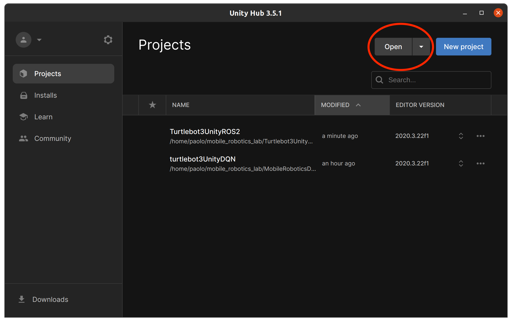
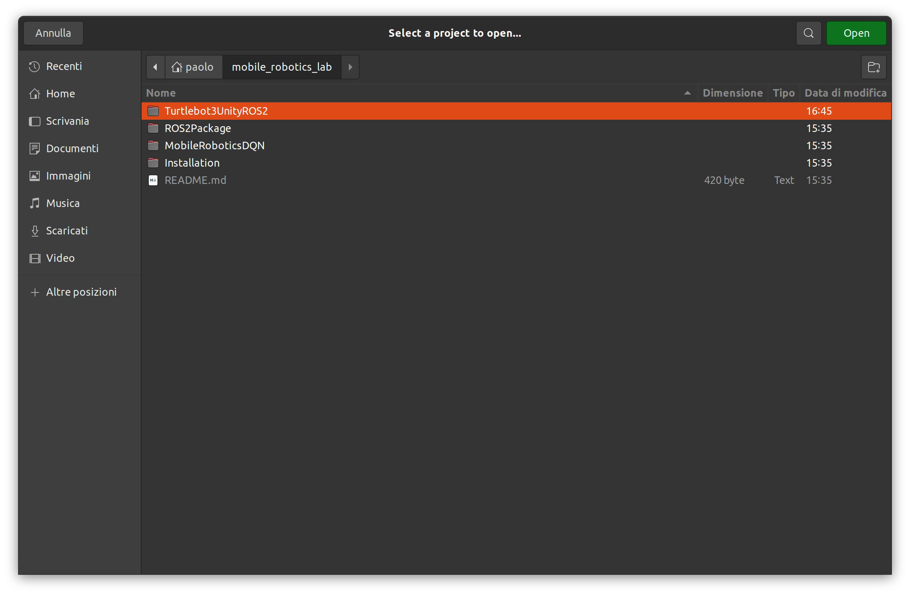
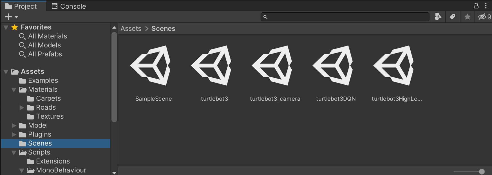
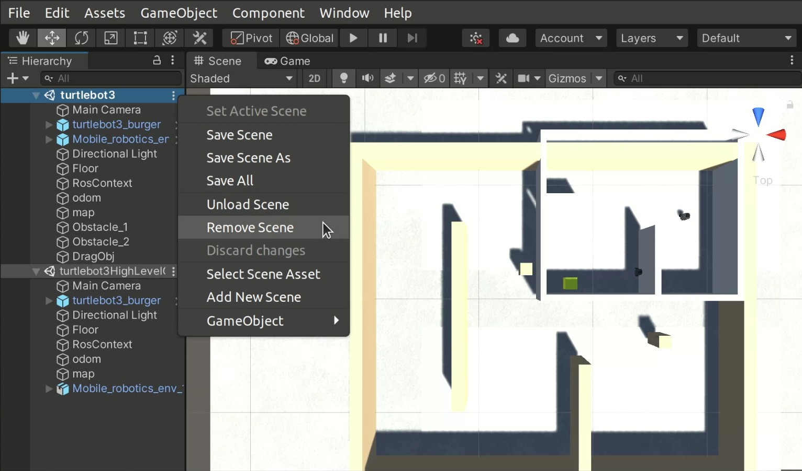
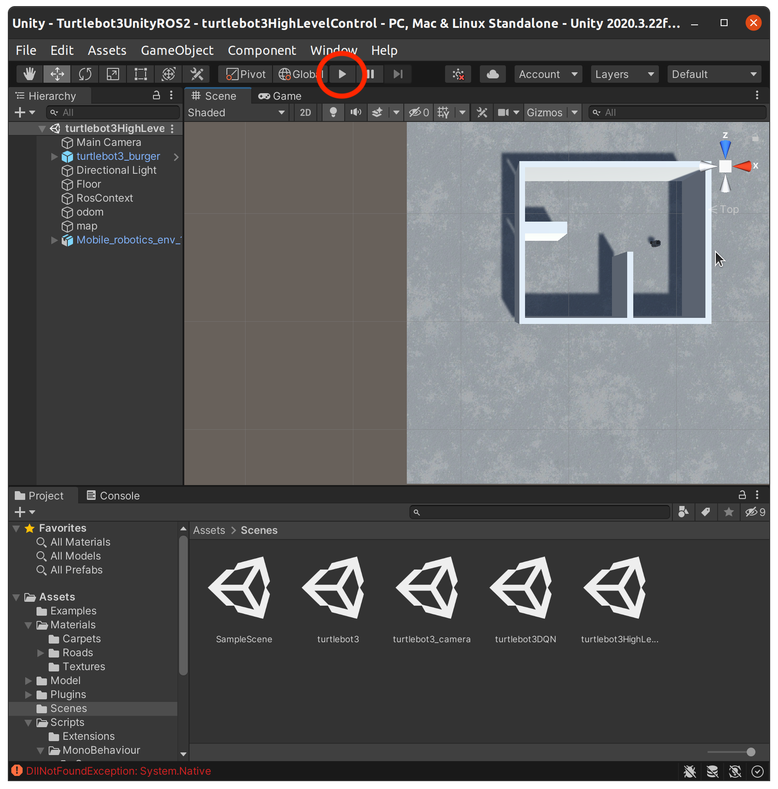
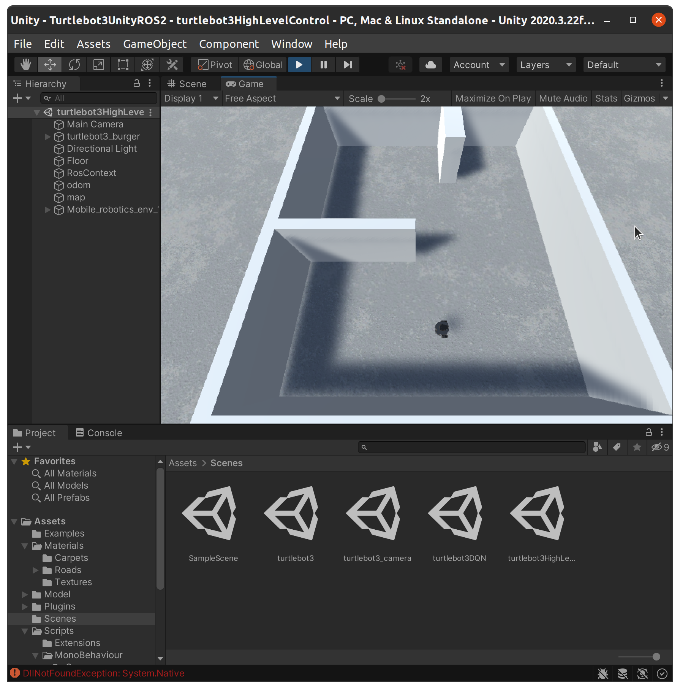
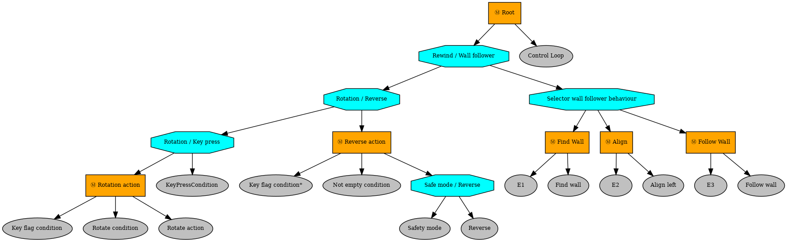

# High Level Control for Sensor Based Navigation using Behavior Trees
High level control denotes the ability of performing a complex task, which is assumed to be composed of many sub-tasks. The State of Art (SoA) offers the following solutions in order to implement high level control:
- Finite State Machines (FSMs)
- Behavior Trees (BTs)
- Petri Nets

This projects aims to modifiy an already implemented algorithm - called Wall Follower - by replacing the underline FSM structure with an equivalent BT.
## Wall Follower algorithm
FSM explanation.
FSM representation.
BT explanation.
BT representation.

# ROS 2 Package Structure
The ROS 2 package is structured as follows.

    turtlebot3_HLC_BT
    ├── package.xml
    ├── setup.cfg
    ├── setup.py
    ├── resource
    |   ├── turtlebot3_HLC_BT
    ├── test
    │   ├── test_copyright.py
    │   ├── test_flake8.py
    │   └── test_pep257.py
    ├── turtlebot3_HLC_BT
    │   ├── __init__.py
    │   └── HLC_BT.py
    └── README.md

# Prerequisites
## 1. OS Requirements
The ROS 2 package has been tested and simulated on `Ubuntu 20.04 LTS`. It does not work on `Ubuntu 22` and it has not been tested on `Ubuntu 18`.

## 2. ROS 2
The project requires ROS 2 Foxy Fitzroy (https://docs.ros.org/en/foxy/Releases/Release-Foxy-Fitzroy.html#foxy-fitzroy-foxy). The ROS 2 workspace is assumed to be called `colcon_ws`. The turtlebot3_HLC_BT package has to be loaded inside ~/colcon_ws/src/ directory.

    colcon_ws
    ├── build
    ├── install
    ├── log
    └── src
        └── turtlebot3_HLC_BT

## 3. Simulation
The ROS 2 package has been simulated by using Unity Hub 3.5.1 together with the 2020.3.22f1 editor version. The simulation environment has to be loaded from the following folder.
```bash
git clone https://gitlab.com/TrottiFrancesco/mobile_robotics_lab.git
```

## 4. Libraries
```bash
sudo pip install pynput==1.7.6
sudo apt install ros-foxy-py-trees-ros==2.1.6
sudo apt install python3-numpy==1.24.4
```

## 5. Check the setuptools version
```bash
pip show setuptools
```
If your setuptools version is higher than 58.2.0 you can either downgrade to 58.2.0 (5a) or replace each '-' character (if any) with '_' inside the `setup.py` file. This will prevent the generation of warnings in step 7.

### 5a. Downgrade setuptools to 58.2.0 [optional]
```bash
pip install setuptools==58.2.0
```

# Simulation
## 1. Set the environment variables
```bash
source /opt/ros/foxy/setup.bash
source /usr/share/colcon_argcomplete/hook/colcon-argcomplete.bash
export TURTLEBOT3_MODEL=burger
source colcon_ws/install/setup.bash
```
## 2. Build and source the workspace
```bash
cd ~/colcon_ws/
colcon build && . install/setup.bash
```

## 3. Start Unity Hub
Click the "Open" button on the top right of the Unity Hub window. Then, select Turtlebot3UnityROS2 folder located inside ~/mobile_robotics_lab/ directory and click open.



## 4. Go to Assets/Scenes/ folder
Open the Assets/Scenes/ folder which can be found in the "Project" tab.


## 5. Load the scene 
Drag the turtlebot3HighLevelControl.unity scene in the tab named "Hierarchy".
https://github.com/ChiaraBozz/Mobile-Robotics-Project/assets/132995885/24fec89a-b52e-4206-a2b3-fe58482d6ed7
Delete any other scene in the "Hierarchy" tab if present.


## 6. Start the simulation
Now it is possible to start the simulation by either clicking the gray play button or pressing Ctrl+P keys.

Check if the simulation has started by observing if the play button has turned blue and the "Game" tab gets selected.


## 7. Execute the package
```bash
ros2 run turtlebot3_HLC_BT turtlebot3_HLC_BT
```
Once the command has been launched, it is possible to see the list of active topics. Just open another terminal window and type:
```bash
ros2 topic list
```
To end the simulation the play button inside Unity has to be pressed (alternetively Ctrl+P) and type in the terminal window Ctrl+C keys. It follows a demostration video.

## 8. Render the Behaviour Tree
You can take a look at the structure of the Behaviour Tree by running:
```bash
ros2 run turtlebot3_HLC_BT turtlebot3_HLC_BT --render
```
In the folder you have launch the code you will found the .png file of the structure of the BT:

